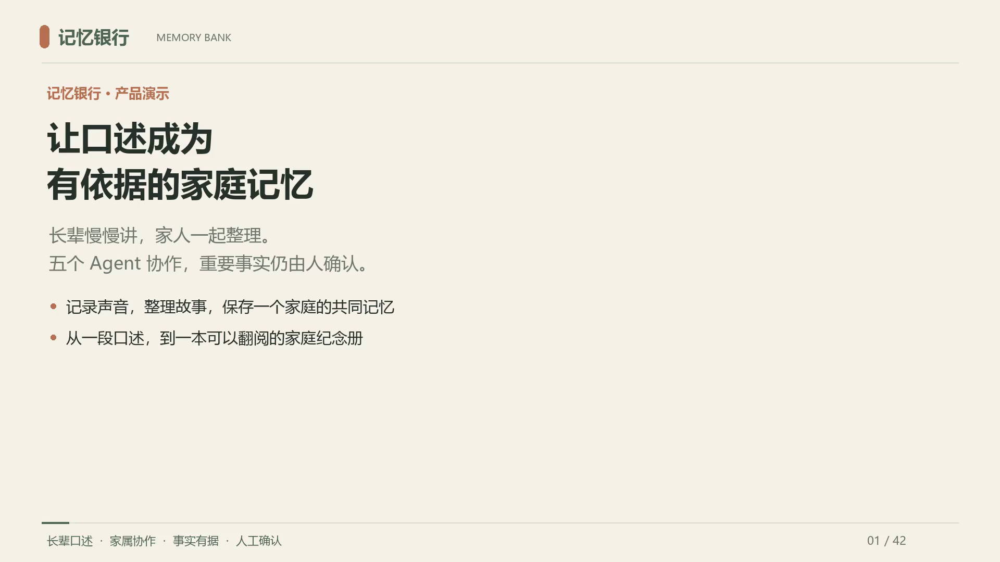
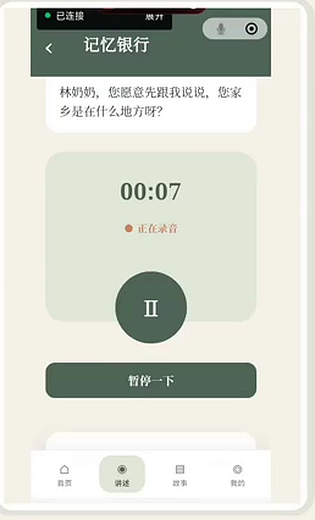
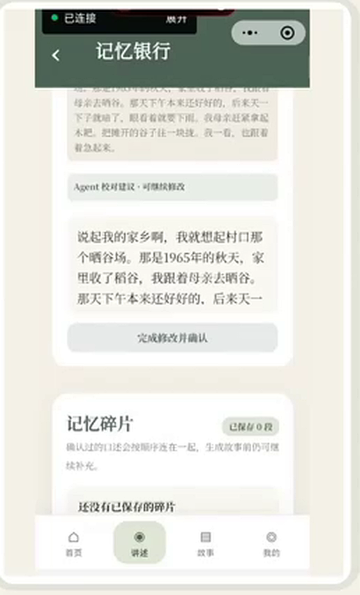
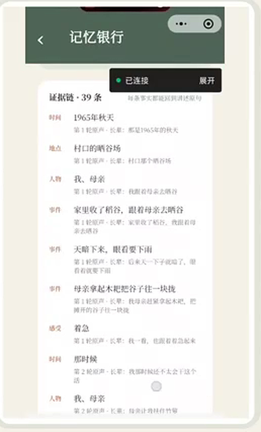
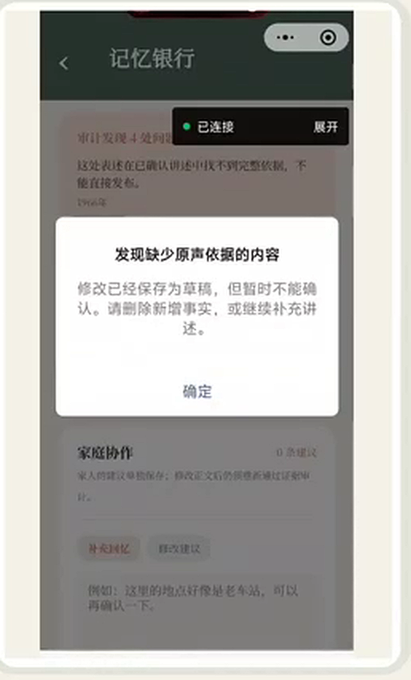
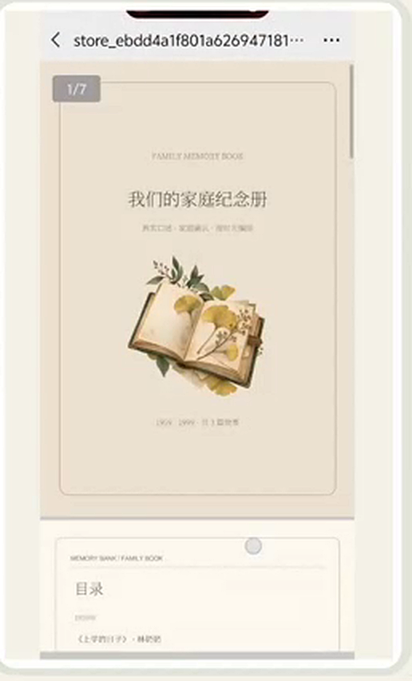
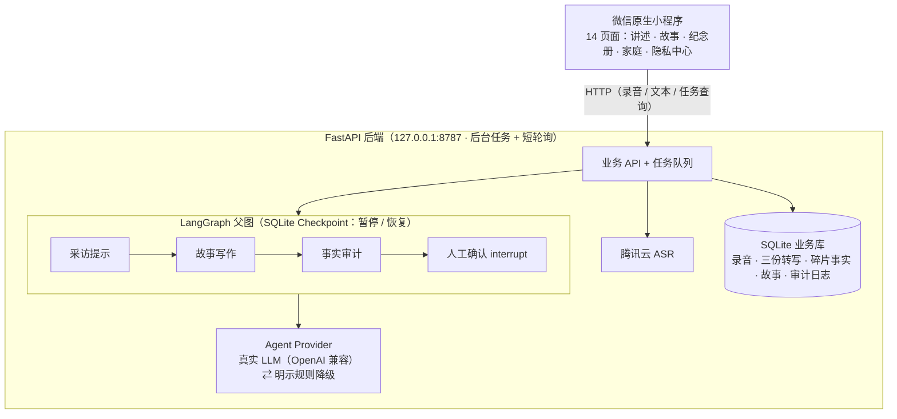
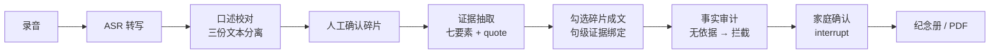

# 记忆银行 Memory Bank

> 让每一段家庭口述记忆，都可信地传下去。

   

**记忆银行**是一个面向家庭口述记忆的可信 AI Agent 应用（微信小程序 + 本机 FastAPI 后端）：长辈对着手机讲往事，腾讯云 ASR 转写后，五个各司其职的 Agent 协助校对、提取证据、温和追问、写作成篇和事实审计——**AI 写下的每一句话都能追溯回老人的原声，故事的发布权始终在人和家属手里**。

<p align="center"></p>

## 为什么做这个

家庭的口述记忆正在流失：长辈的故事散落在饭桌闲谈里，晚辈想记却难成体系；而直接把录音丢给大模型"整理成文"，又会引入幻觉——**编造的年份、张冠李戴的人物，对家庭记忆是不可逆的污染**。

记忆银行的回答不是"更强的写作模型"，而是**证据链约束下的多 Agent 协作**：模型只做组织和追问，事实必须由讲述者确认、由原文支撑，无依据的句子会被审计拦截，发布与否由家人决定。

## 演示

- 🎬 **演示视频**：[assets/demo/memory-bank-demo.mp4](assets/demo/memory-bank-demo.mp4)（10 分钟 · 42 页产品讲解，覆盖录音 → 转写校对 → 证据抽取 → 采访追问 → 双风格写作 → **审计拦截** → 家人确认 → 纪念册与 PDF 导出的完整主线）
- 💻 **零密钥体验**：`.env` 保持 `AGENT_MODE=mock` 即可启动完整流程（本地规则引擎驱动全部五个 Agent，不调用外部模型），克隆后 5 分钟可跑通，见[快速开始](#快速开始)。

<details>
<summary>四个本机演示账号（密码统一 <code>123456</code>，固定验证码登录用 <code>246810</code>）</summary>

| 账号 | 手机号 | 身份 |
| --- | --- | --- |
| 林奶奶 | `13800008899` | 长辈、主要讲述者 |
| 王爷爷 | `13900007788` | 长辈、另一位讲述者 |
| 小刘 | `13700006677` | 晚辈家属、家庭管理员 |
| 小李 | `13600005566` | 晚辈家属 |

四账号共享同一个本机家庭，用于演示"晚辈可代为校对/审核，但讲述者归属不变"的可信边界。演示账号仅用于本机演示，请勿在真实环境沿用统一密码。

</details>

| 讲述页：按下录音，慢慢讲 | 校对页：三份文字，各司其职 |
| --- | --- |
|  |  |
| **证据锁：39 条事实，每个都有出处** | **事实审计：无原声依据 → 拦截确认** |
|  |  |
| **家庭纪念册：按时间翻阅的一本书** | **PDF 导出：可以留下来的载体** |
|  |  |

> 更多界面：采访追问（[interview](docs/images/interview.png)）、碎片确认（[confirm](docs/images/confirm.png)）、正文逐句依据（[sentence](docs/images/sentence.png)）、拦截后确认按钮置灰（[audit-block](docs/images/audit-block.png)）、双风格对照（[styles](docs/images/styles.png)）、ASR 转写（[asr](docs/images/asr.png)）。

## 核心特性

- 🎙️ **录音 → 转写 → 校对**：微信录音，腾讯云 ASR 真实转写；转写失败保留录音、可重试或人工填写，不会静默填入假数据。
- 🔍 **七要素证据抽取**：时间、地点、人物、事件、结果、影响、感受；每条事实必须携带原文引用（`quote` 必须是确认文本的真实子串），找不到证据就留空，禁止推测。
- 🗣️ **LangGraph 采访会话**：依据"已讲了什么、还缺什么"生成下一问，已知要素与重复问题会被本地校验拦截；会话通过 SQLite Checkpoint 暂停恢复，后端重启后可继续未完成的采访。
- ✍️ **两种成文风格**：`原味口述` / `适合成书`，逐句绑定证据关系；混用两位讲述者的素材会被服务端拒绝。
- 🛡️ **事实审计门**：模型逐句核查 + 本地确定性证据规则双重校验，发现无依据内容禁止发布，并尝试自动修订一次；冲突讲述并列保留原话，**系统不代替家人裁决**。
- 📖 **家庭纪念册**：已确认故事按年份编排、左右翻页阅读，可导出为带静态装饰插画的 PDF 在微信中打开；未确认草稿不进入纪念册。
- ⚙️ **工程完备**：后台任务 + 短轮询（长流程不超时）、明示的规则降级（`fallbackCount` 可观测）、小程序与后端共 98 项自动化测试。

## 可信机制：AI 不替家人做主

这是本项目与"套壳写作工具"的根本区别，每条约束都落在代码里：

| 约束 | 实现 |
| --- | --- |
| 原始转写、AI 建议、人工确认**三份文本分离保存** | `asrRawText` / `agentCleanText` / `confirmedText`，Agent 无权覆盖原文 |
| 证据必须可追溯 | 每条事实携带 `fragmentId`、`recordingId`、`narratorUserId` 与原文 `quote`（真实子串，服务端校验） |
| 讲述者归属不可变 | 录音创建时锁定 `narratorUserId`；晚辈校对后仍是"林奶奶的记忆"，仅追加"小刘已确认" |
| 写作不得新增事实 | 只允许使用同讲述者、已确认的碎片；逐句绑定证据 |
| 无依据内容禁止发布 | 模型逐句审计 + 本地确定性规则；`unsupported` 内容拦截，草稿保留待修正 |
| 发布权在人 | LangGraph `interrupt` 人工确认节点；AI 建议 ≠ 用户原话，草稿 ≠ 已发布故事 |

## 五个核心 Agent

五个 Agent 是五种职责，**不要求五个模型或五把 API Key**——真实模式下它们通过同一个 OpenAI 兼容接口（通义 / 智谱 / DeepSeek 等均可）、不同 Prompt 与结构化输出 Schema 协作：

| Agent | 时机 | 硬约束 |
| --- | --- | --- |
| 口述校对 | ASR 成功后 | 给出可编辑建议与不确定项，不覆盖原文、不新增事实 |
| 记忆证据 | 碎片经人确认后 | 七要素抽取，quote 必须为确认文本真实子串，冲突并列保留 |
| 采访提示 | 开场及每轮确认后 | 只读"当前讲述者 + 当前主题"的已确认内容；重复问题、已知要素会被本地拦截 |
| 故事写作 | 勾选碎片并选择风格后 | 只用所选证据，句子级证据关系；跨讲述者混选被拒 |
| 事实审计 | 发布前 | 逐句核查新增人物/时间/地点/动作/结果，无依据即拦截 |

## 架构

**当前实现**（与代码一一对应）：



**可信闭环主流程**：



> Agent 协同设计与 LangGraph 完整图解（含规划中的目标态架构）见 [docs/AGENTS_ARCHITECTURE.md](docs/AGENTS_ARCHITECTURE.md) 与 [docs/记忆银行_LangGraph完整架构图解.docx](docs/记忆银行_LangGraph完整架构图解.docx)。

## 快速开始

> 环境：Python 3.11+、Node.js、微信开发者工具。Windows / PowerShell 示例（macOS/Linux 将路径分隔符替换即可）。

**① 克隆并安装（约 3 分钟）**

```powershell
git clone https://github.com/tzr1285195647-max/memory-bank-work.git
cd memory-bank-work
Copy-Item .env.example .env
python -m venv .venv
.\.venv\Scripts\python.exe -m pip install -r backend\requirements.txt
npm ci
```

**② 启动后端（零密钥即可）**

`.env` 保持 `AGENT_MODE=mock`——这不是静态假页面，而是由本地规则引擎完整驱动的五个 Agent + 真实录音接口。启动：

```powershell
.\.venv\Scripts\python.exe backend\run.py
```

**③ 打开小程序**

微信开发者工具导入仓库根目录 → 「详情 → 本地设置」勾选「不校验合法域名」→ 使用上方任一演示账号登录。

**④（可选）接入真实模型与 ASR**

```ini
AGENT_MODE=llm
LLM_API_KEY=你的密钥
LLM_BASE_URL=https://api.deepseek.com   # 兼容 OpenAI 协议的服务均可
LLM_MODEL=deepseek-chat
TENCENTCLOUD_SECRET_ID=你的腾讯云 ID
TENCENTCLOUD_SECRET_KEY=你的腾讯云 Key
```

完整选项见 [`.env.example`](.env.example) 与 [docs/LLM_SETUP.md](docs/LLM_SETUP.md)。真机调试需将 `.env` 改为 `HOST=0.0.0.0` 并修改 [`config.js`](config.js) 的 `deviceBaseUrl` 为本机局域网 IPv4。

**⑤ 验证**

```powershell
npm run test:miniprogram
.\.venv\Scripts\python.exe -m pytest backend\tests -q
.\.venv\Scripts\python.exe backend\demo_check.py --readonly
```

## 真实使用案例

<!-- TODO(参赛前必补): 评审重点之一。找 1-2 个真实家庭试用后填写，格式建议：
### 案例一：XXX 家的口述记忆（2026.10）
- 讲述者：75 岁母亲；参与者：女儿（异地，微信协同）
- 过程：3 次讲述共 40 分钟录音 → 12 段确认碎片 → 3 个确认故事
- 产出：《XXX 家的岁月》PDF 纪念册（26 页），审计拦截 2 处 AI 误加的年份
- 反馈：引用一句家人的原话
-->

*待补充：我们正在邀请真实家庭试用，案例数据将于近期更新。*

## 质量与测试

- 小程序测试 + 后端 pytest 共 **98 项自动化测试**全部通过；后端测试在隔离的临时数据库上运行，不触碰本机业务库。
- 只读自检 `backend/demo_check.py --readonly` 可在演示前验证依赖可用且不改动数据。
- 模型输出经过 Pydantic / JSON Schema 与本地证据规则双重校验；降级调用计入 `fallbackCount`，可观测、不可静默。

## 路线图

**已实现**：录音转写与三份文本分离、七要素证据链、LangGraph 采访（暂停/恢复）、双风格写作与逐句证据、事实审计门、家庭纪念册与 PDF 导出、98 项自动化测试。

**进行中 / 规划**：家庭邀请接受流程、真实短信验证、动态插画、家庭回忆录编辑 Agent、美术编排 Agent、RAG 记忆检索、公网部署（当前定位为本机/局域网演示）。

> 我们坚持"设计不冒充实现"：上表中未完成的能力不会出现在演示与提交材料里。

## 文档索引

| 文档 | 内容 |
| --- | --- |
| [docs/DEV_GUIDE.md](docs/DEV_GUIDE.md) | 开发交接：运行细节、演示路径、验收标准、已知限制 |
| [docs/AGENTS_ARCHITECTURE.md](docs/AGENTS_ARCHITECTURE.md) | 五类 Agent 职责、协同图与硬约束 |
| [docs/BACKEND.md](docs/BACKEND.md) | 后端结构说明 |
| [docs/LLM_SETUP.md](docs/LLM_SETUP.md) | 模型与 ASR 配置 |
| [docs/DESIGN_SPEC.md](docs/DESIGN_SPEC.md) | 设计规范 |
| [agent.md](agent.md) | 项目规则与验收标准（以本文件为准） |

## 已知限制

故事确认依赖后端可连接且通过逐句证据复审；家庭邀请接受/拒绝、真实短信、RAG、账号找回、公网部署不属于当前已完成功能；自动审计不能替代长辈核对原声——它的作用是把可疑内容拦在发布之前。完整清单见 [docs/DEV_GUIDE.md](docs/DEV_GUIDE.md) 末节。

## License

[MIT](LICENSE) © 2026 memory-bank-work contributors
